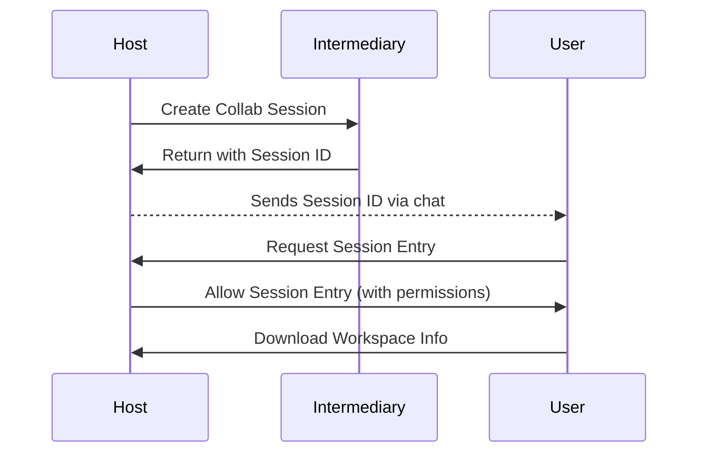
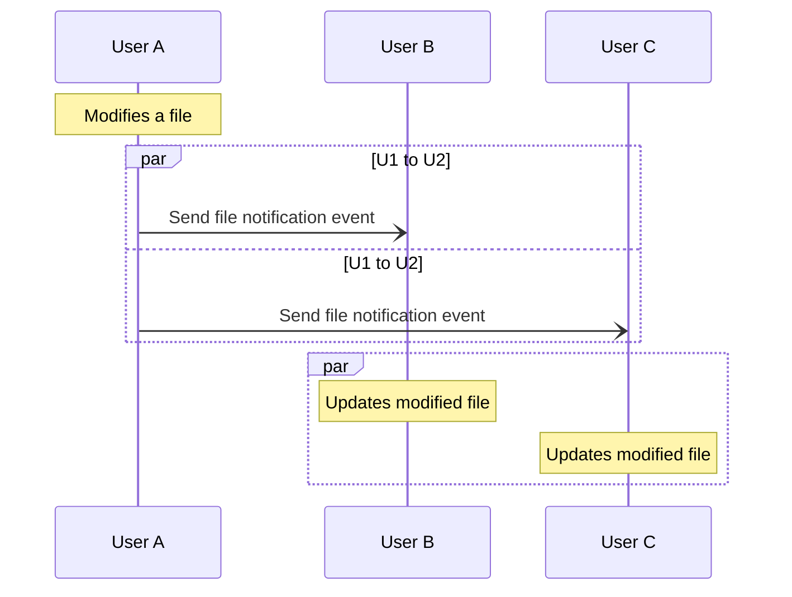
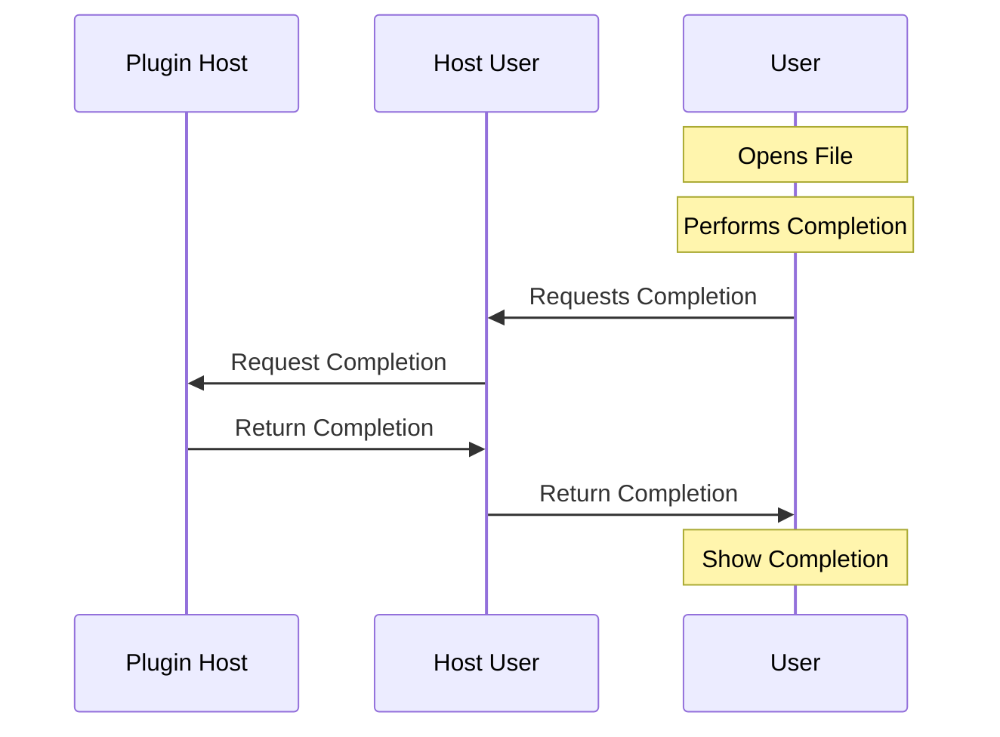

# Collaboration Concept

## Microsoft VSCode Live Share Extension

The official Microsoft [Live Share Extension](https://visualstudio.microsoft.com/services/live-share/) implements collaboration support for the following features:

- Editor Syncing (Text + Client markers for each user)
- Host Syncing (i.e. other users follow the host into their currently selected file + position)
- Terminal Syncing (if enabled). Both input+output is synced
- Debug Syncing (if enabled). Both users and host can step through the code as if it were on one machine. Breakpoints are synced as well.
- Plugin Syncing (i.e. external user has access to all installed plugins/extensions of the host user)
- Chat Functionality
- Mechanism for making the API available to other extensions, see [vsls](https://www.npmjs.com/package/vsls)

Similar to the tunnel feature, the connection between host and other users is accomplished using hole-punching.
I.e. a single central server serves as an intermediary to exchange messages. No messages are being exchanged directly between users. 

## Requirements for Theia Collaboration Feature

### Technical Requirements

The protocol/implementation that this new live share feature is supposed to be using therefore has a few different tasks for different widgets/features

1. Document syncing akin to yjs monaco binding + Awareness information exchange (i.e. broadcast information to all users)
2. Virtual File System coming from the host user
3. Frontend message proxying for debug sync (i.e. debug launch or monaco language service requests need to be proxied to the plugin host and the results send back)
4. Terminal input + output syncing requires a yjs like approach for input and a broadcast for output
5. Broadcast required for Chat functionality

### Messaging System Architecture

For the technical requirements above, we effectively need a two different kind of message types:

1. Broadcasting actions to all users:
    1. Document entry events (yjs shared data types sync; monaco editor + terminal input)
    2. Awareness information broadcast, i.e. current cursor position in monaco/custom editor
    3. Chat functionality
    4. Output of host terminal
2. Proxy message to host (with result or without):
    1. Debug launch (notification)
    2. File System information
    3. Monaco language services (i.e. LSP requests)

The following diagram shows the Session creation/entry negotiations. In all cases where the User/Host communicate directly in the diagram, the intermediary server provides the messaging exchange infrastructure (using a hole-punching mechanism). The host is always the user that provides the workspace



Diagram outlining the broadcasting mechanism. We skip the Intermediary here, since it only proxies messages between users. Also note that we don’t need a host, since in this message scenario, all users have “equal rights”. This example uses the notification for file changes, but can be used for broadcasts for debugging or terminal output



Proxy host messaging example:



## Coordination/Messaging Server

For the messages architecture above, we need a coordination or messaging server. The server serves exactly two purposes:

1. Opening up the host system to the world. The host and the coordination server negotiate a new collab session. This can be as simple as an HTTP call to this server. The coordination server then creates a virtual room and assigns the host that originated the call as its host.
2. Communication between collaborators within a session. For example, a broadcast notification needs to be send to the coordination server first, which then relays the message to all other participants.

Assuming the server is built specifically for Theia, we can reuse some of Theia’s dependencies for this, i.e. socket-io for bidirectional, high-performance messaging on top of HTTP.


## API Concept

The following outlines the API that is supposed to be used to implement the technical requirements above.
All 3 message types (broadcast, request, notification) can be accomplished using this approach.

```ts
// Message type:
export type DocumentUpdateInfo = {
    documentUri: string
    text: string
    range: Range
}
export const DocumentUpdate: Broadcast<DocumentUpdateInfo> = { 
    kind: 'Broadcast', 
    method: 'DocumentUpdate' 
};
// Alternatively Notification<P>/Request<P>

// Message listener:
session.onBroadcast(DocumentUpdate, /** automatically typed as `DocumentUpdateInfo` */ updateInfo => {

});
// alternatively onRequest/onNotification

// Message sender:
session.sendBroadcast(DocumentUpdate, /** automatically typed as `DocumentUpdateInfo` */ {
    documentUri,
    text,
    range
});
// alternatively sendRequest/sendNotification
```
