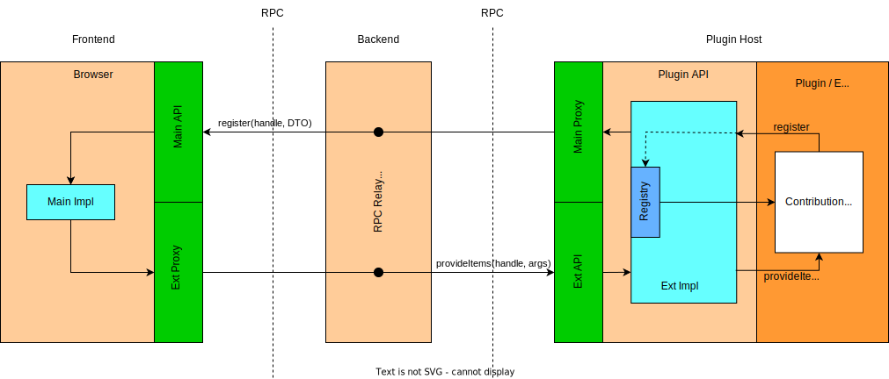
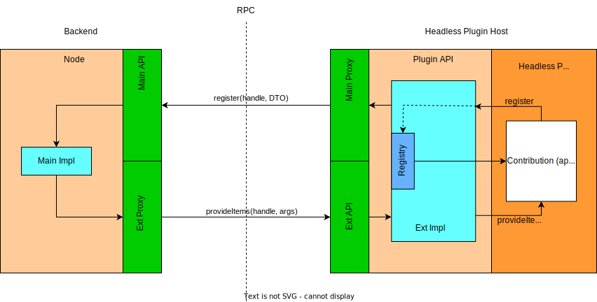

# Theia Plugin API and VS Code extensions support

Eclipse Theia is designed for extensibility.
Therefore, it supports [three extension mechanisms: VS Code extensions, Theia extensions, and Theia plugins](https://theia-ide.org/docs/extensions/).
In the following, we focus on the mechanics of Theia plugins and Theia’s compatibility with the [VS Code Extension API](https://code.visualstudio.com/api) in order to support running VS Code extensions in Theia.
This documentation aims to support developers extending Theia’s plugin API to either enhance the extensibility of Theia via plugins and/or increase Theia’s coverage of the VS Code Extension API – and with that the number of VS Code extensions that can be used in Theia.

Theia plugins, as well as VS Code extensions, can be installed and removed from a Theia installation at runtime.
There are three kinds of plugins that address different extensibility use cases:

- VS Code plugins may extend many different user-facing capabilities of Theia, such as theming, language support, debuggers, tree views, etc., via a clearly defined API.
_In the context of VS Code itself these are called "extensions", not to be confused with build-time Theia extensions._
- Theia plugins are a superset of VS Code plugins using a largely compatible API with some additional capabilities not applicable to VS Code
- Headless plugins address application-specific extension points.
They do not extend the user-facing capabilities of Theia as the other two categories of plugins do, but support application-specific services that, in turn, often do.
More information about headless plugins [is detailed below](#headless-plugins).

A plugin runs inside a "host process".
This is a subprocess spawned by Theia's backend to isolate the plugin from the main process.
This encapsulates the plugin to prevent it from arbitrarily accessing Theia services and potentially harm performance or functionality of Theia’s main functionality.
Instead, a plugin accesses Theia’s state and services via the plugin API, if any, provided within its host process.

Theia’s plugin API strives to be a superset of VS Code’s extension API to enable running VS Code extensions as Theia plugins.
For many cases this already works well.
A report on API compatibility is generated daily in the [vscode-theia-comparator repository](https://github.com/eclipse-theia/vscode-theia-comparator).
Please note that the report only checks the API on an interface level – and not the compatibility of the interfaces’ implementation behaviour.
To be sure that an extension is fully supported, it is recommended to test it yourself.
Feel free to [open new issues](https://github.com/eclipse-theia/theia/issues/new/choose) for missing or incomplete API and link them in the report via a [pull request](https://github.com/eclipse-theia/vscode-theia-comparator/compare).
The report can be found here:

[](https://eclipse-theia.github.io/vscode-theia-comparator/status.html)

## Relevant Theia source code

- [plugin](https://github.com/eclipse-theia/theia/tree/master/packages/plugin): Contains the API declaration of the theia plugin namespace.
- [plugin-ext](https://github.com/eclipse-theia/theia/tree/master/packages/plugin-ext): Contains both the mechanisms for running plugins and providing them with an API namespace and the implementation of the ‘theia’ plugin API.
- [plugin-ext-vscode](https://github.com/eclipse-theia/theia/tree/master/packages/plugin-ext-vscode): Contains an implementation of the VS Code plugin API.
Since VS Code and Theia APIs are largely compatible, the initialization passes on the Theia plugin API and overrides a few members in the API object to be compatible to VS Code extensions (see [plugin-ext-vscode/src/node/plugin-vscode-init.ts](https://github.com/eclipse-theia/theia/blob/master/packages/plugin-ext-vscode/src/node/plugin-vscode-init.ts)).
- [plugin-ext-headless](https://github.com/eclipse-theia/theia/tree/master/packages/plugin-ext-headless): Contains the mechanism for running "headless" plugins in a dedicated backend plugin host process.

## API definition and exposure

The plugin API is declared in the [plugin](https://github.com/eclipse-theia/theia/tree/master/packages/plugin) package in file [theia.d.ts](https://github.com/eclipse-theia/theia/blob/master/packages/plugin/src/theia.d.ts).

The implementation of the API defined in the plugin package is passed to a plugin by manipulating the module loading mechanism in plugin containers to construct an API module object.
This enables Theia plugins to import the API via the `@theia/plugin` module in node or via the `theia` namespace in web workers.
For VS Code plugins, the same API is available via the `vscode` namespace as expected by them.

Plugin containers are node processes (see [plugin-ext/src/hosted/node/plugin-host.ts](https://github.com/eclipse-theia/theia/blob/master/packages/plugin-ext/src/hosted/node/plugin-host.ts))and web workers ([plugin-ext/src/hosted/browser/worker/worker-main.ts](https://github.com/eclipse-theia/theia/blob/master/packages/plugin-ext/src/hosted/browser/worker/worker-main.ts)).
These expose the API in the following places:

- Browser: assign API object to `window['theia']` in [plugin-ext/src/hosted/browser/worker/worker-main.ts](https://github.com/eclipse-theia/theia/blob/541b300adc029ab1dd729da1ca49179ace1447b2/packages/plugin-ext/src/hosted/browser/worker/worker-main.ts#L192).
- Back-end/Node: Override module loading for Theia plugins in [plugin-ext/src/hosted/node/scanners/backend-init-theia.ts](https://github.com/eclipse-theia/theia/blob/master/packages/plugin-ext/src/hosted/node/scanners/backend-init-theia.ts) and for VS Code plugins in [plugin-ext-vscode/src/node/plugin-vscode-init.ts](https://github.com/eclipse-theia/theia/blob/master/packages/plugin-ext-vscode/src/node/plugin-vscode-init.ts).

**Note** that it is not necessary to adapt these for implementing new plugin API.

## Communication between plugin API and Theia

As the plugin runs in a separate process, the plugin API cannot directly communicate with Theia.
Instead, the plugin process and Theia’s main process communicate via RPC.

For VS Code plugins and Theia plugins, the following "Main-Ext" pattern is used.
There is one instance of the plugin host process for each connected frontend.



`Ext` refers to the code running on the plugin side inside the isolated host process.
Therefore, this code cannot directly use any Theia services (e.g. via dependency injection).
`Main` refers to code running inside the Theia frontend in the **browser** context.
Therefore, it can access any Theia service just like a [build time Theia extension](https://theia-ide.org/docs/authoring_extensions/).

> [!NOTE]
> As the plugin hosts for VS Code plugins are scoped per frontend connection and the `Main` side resides in the browser, there is actually an indirection of the RPC communication channel via the Theia backend.
> This simply relays the messages in both directions as depicted in the diagram.

For headless plugins, "Main-Ext" pattern is very similar, except that there is only one instance of the plugin host and the `Main` code runs in the **node** context, as there is no associated frontend context for headless plugins.



As the lifecycle of a plugin starts inside its process on the `Ext` side, anything that the plugin needs from Theia (e.g. state, command execution, access to services) has to be invoked over RPC via an implementation on the `Main` side.
In the inverse direction, the same is true for code that runs on the `Main` side and that needs something from the plugin side (e.g. changing plugin state after a user input).
It needs to be invoked over RPC via an implementation on the `Ext` side.
Therefore, `Main` and `Ext` interfaces usually come in pairs (e.g. [LanguagesExt](https://github.com/eclipse-theia/theia/blob/541b300adc029ab1dd729da1ca49179ace1447b2/packages/plugin-ext/src/common/plugin-api-rpc.ts#L1401) and [LanguagesMain](https://github.com/eclipse-theia/theia/blob/541b300adc029ab1dd729da1ca49179ace1447b2/packages/plugin-ext/src/common/plugin-api-rpc.ts#L1474)).

To communicate with each other, the implementation of each side of the API - `Main` and `Ext` - has an RPC proxy of its corresponding counterpart.
The proxy is based on the interface of the other side: `Main` implementation has a proxy of the `Ext` interface and vice versa.
The implementations do not have explicit dependencies to each other.

### Encoding and Decoding RPC Messages

The communication between each side of the API is governed by proxies that use an `RpcProtocol` on a given channel to transmit RPC messages such as requests and notifications.
In Theia, the encoding and decoding process of RPC messages can be customized through dedicated `RpcMessageEncoder` and `RpcMessageDecoder` classes that can be provided when a new RpcProtocol is created.
The `RpcMessageEncoder` writes RPC messages to a buffer whereas the `RpcMessageDecoder` parses a binary message from a buffer into a RPC message.

By default, Theia uses an encoder and decoder based on [msgpackr](https://www.npmjs.com/package/msgpackr) that already properly handles many JavaScript built-in types, such as arrays and maps.
We can separately extend the encoding and decoding of our own classes by installing extensions using the `MsgPackExtensionManager` singleton, accessible from both ends of the channel.
Examples of this can be found in the [extension for Errors](https://github.com/eclipse-theia/theia/blob/72421be24d0461f811a39324579913e91056d7c4/packages/core/src/common/message-rpc/rpc-message-encoder.ts#L171) and the [extension for URI, Range and other classes](https://github.com/eclipse-theia/theia/blob/72421be24d0461f811a39324579913e91056d7c4/packages/plugin-ext/src/common/rpc-protocol.ts#L223).
We call the registration of these extensions in `index.ts` to ensure they are available early on.
Please note that msgpackr [always registers extensions globally](https://github.com/kriszyp/msgpackr/issues/93) so the extensions leak into all connections within Theia, i.e., also non-API related areas such as the frontend-backend connection.
And while the number of custom extensions is [limited to 100](https://github.com/kriszyp/msgpackr?tab=readme-ov-file#custom-extensions), checking the extensions for every single message may impact performance if there are many extensions or the conversion is very expensive.
Another hurdle is that we need to ensure that we always detect the correct type of object purely from the object shape which may prove difficult if there are hundreds of objects and custom instances from user code.
Consequently, we mainly use the msgpackr extension mechanism for very few common classes but rely on custom data transfer objects (DTOs) for the Theia plugin API, see also [Complex objects and RPC](#complex-objects-and-rpc).

## Adding new API

This section gives an introduction to extending Theia’s plugin API. If you want to add a complete custom plugin API in your own extension, see this [readme](https://github.com/eclipse-theia/theia/blob/master/packages/plugin-ext/doc/how-to-add-new-custom-plugin-api.md).

For adding new API, the first step is to declare it in the [theia.d.ts](https://github.com/eclipse-theia/theia/blob/master/packages/plugin/src/theia.d.ts) file in the plugin package.
In a second step, the implementation for the new API must be made available in the returned object of the API factory in [plugin-context.ts](https://github.com/eclipse-theia/theia/blob/master/packages/plugin-ext/src/plugin/plugin-context.ts).
Typically, functions or properties returned by the API factory delegate to an `Ext` implementation that actually provides the functionality.
See the following shortened and commented excerpt from [plugin-context.ts](https://github.com/eclipse-theia/theia/blob/master/packages/plugin-ext/src/plugin/plugin-context.ts)#createAPIFactory:

```typescript
// Creates the API factory used to create the API object for each plugin
// Implementations handed into this are shared between plugins
export function createAPIFactory(
    rpc: RPCProtocol,
    pluginManager: PluginManager,
    envExt: EnvExtImpl,
    debugExt: DebugExtImpl,
    preferenceRegistryExt: PreferenceRegistryExtImpl,
    editorsAndDocumentsExt: EditorsAndDocumentsExtImpl,
    workspaceExt: WorkspaceExtImpl,
    messageRegistryExt: MessageRegistryExt,
    clipboard: ClipboardExt,
    webviewExt: WebviewsExtImpl
): PluginAPIFactory {

    // Instantiation of Ext services.
    // Instantiate and register with RPC so that it will be called when the main side uses its proxy.
    const authenticationExt = rpc.set(MAIN_RPC_CONTEXT.AUTHENTICATION_EXT, new AuthenticationExtImpl(rpc));
    const commandRegistry = rpc.set(MAIN_RPC_CONTEXT.COMMAND_REGISTRY_EXT, new CommandRegistryImpl(rpc));
    // [...]

    // The returned function is used to create an instance of the plugin API for a plugin.
    return function (plugin: InternalPlugin): typeof theia {
        const authentication: typeof theia.authentication = {
            // [...]
        };

        // [...]

        // Here the API is returned. Add members of the root namespace directly to the returned object.
        // Each namespace is contained in its own property.
        return <typeof theia>{
            version: require('../../package.json').version,
            // The authentication namespace
            authentication,
            // [...]
            // Types
            StatusBarAlignment: StatusBarAlignment,
            Disposable: Disposable,
            EventEmitter: Emitter,
            CancellationTokenSource: CancellationTokenSource,
            // [...]
        };
    };
}
```

### Adding new Ext and Main interfaces with implementations

`Ext` and `Main` interfaces only contain the functions called over RPC.
Further functions are just part of the implementations.
Functions to be called over RPC must start with `$`, e.g. `$executeStuff`.

- Define `Ext` and `Main` interfaces in [plugin-ext/src/common/plugin-api-rpc.ts](https://github.com/eclipse-theia/theia/blob/master/packages/plugin-ext/src/common/plugin-api-rpc.ts).
The interfaces should be suffixed with `Ext` and `Main` correspondingly (e.g. `LanguagesMain` and `LanguagesExt`).
- In [plugin-ext/src/common/plugin-api-rpc.ts](https://github.com/eclipse-theia/theia/blob/master/packages/plugin-ext/src/common/plugin-api-rpc.ts), add a proxy identifier for the `Ext` interface to `MAIN_RPC_CONTEXT` and one for the `Main` interface to `PLUGIN_RPC_CONTEXT`
- Create the `Ext` implementation in folder [plugin-ext/src/plugin](https://github.com/eclipse-theia/theia/tree/master/packages/plugin-ext/src/plugin).
- Create the `Main` implementation in folder [plugin-ext/src/main/browser](https://github.com/eclipse-theia/theia/tree/master/packages/plugin-ext/src/main/browser).
- To communicate via RPC, each implementation has a proxy depending on the interface on the other side.
For instance, see `LanguagesExtImpl` in [plugin-ext/src/plugin/languages.ts](https://github.com/eclipse-theia/theia/blob/master/packages/plugin-ext/src/plugin/languages.ts) and `LanguagesMainImpl` in [plugin-ext/src/main/browser/languages-main.ts](https://github.com/eclipse-theia/theia/blob/master/packages/plugin-ext/src/main/browser/languages-main.ts).
They each create the proxy to the other side in their constructors by using the proxy identifiers.

### Complex objects and RPC

When [encoding and decoding RPC messages](#encoding-and-decoding-rpc-messages) pure DTO objects that only carry properties can always be transmitted safely.
However, due to the necessary serialization process, functions and references to other objects can never be transmitted safely.

If functions of objects need to be invoked on the opposite side of their creation, the object needs to be cached on the creation side.
The other side receives a handle (usually an id) that can be used to invoke the functionality on the creation side.
As all cached objects are kept in memory, they should be disposed of when they are no longer needed.
For instance, in [LanguagesExtImpl#registerCodeActionsProvider](https://github.com/eclipse-theia/theia/blob/master/packages/plugin-ext/src/plugin/languages.ts) a new code action provider is created and cached on the `Ext` side and then registered on the `Main` side via its handle.
When the code action provider’s methods are later invoked on the `Main` side (e.g. in [LanguagesMainImpl#provideCodeActions](https://github.com/eclipse-theia/theia/blob/master/packages/plugin-ext/src/main/browser/languages-main.ts)), it calls the `Ext` side with this handle.
The `Ext` side then gets the cached object, executes appropriate functions and returns the results back to the `Main` side (e.g. in [LanguagesExtImpl#$provideCodeActions](https://github.com/eclipse-theia/theia/blob/master/packages/plugin-ext/src/plugin/languages.ts)).
Another example to browse are the [TaskExtImpl](https://github.com/eclipse-theia/theia/blob/master/packages/plugin-ext/src/plugin/tasks/tasks.ts) and [TaskMainImpl](https://github.com/eclipse-theia/theia/blob/master/packages/plugin-ext/src/main/browser/tasks-main.ts) classes.

To [ensure correct type conversion](#encoding-and-decoding-rpc-messages) between the Theia backend and the plugin host we define an API protocol based on types and DTOs that can be transmitted safely.
The plugin API and its types are defined in [plugin-ext/src/common/plugin-api-rpc.ts](https://github.com/eclipse-theia/theia/blob/master/packages/plugin-ext/src/common/plugin-api-rpc.ts) with some additional conversion on the `Ext` side being defined in [plugin-ext/src/plugin/type-converters.ts](https://github.com/eclipse-theia/theia/blob/master/packages/plugin-ext/src/plugin/type-converters.ts).
Thus, this is also a good starting point to look for conversion utilities for existing types.

### Adding new types

New classes and other types such as enums are usually implemented in [plugin-ext/src/plugin/types-impl.ts](https://github.com/eclipse-theia/theia/blob/master/packages/plugin-ext/src/plugin/types-impl.ts).
They can be added there and then we can add them to the API object created in the API factory.

## Headless Plugins

The majority of plugin use cases are for extension of the Theia user experience via the VS Code compatible API provided by Theia.
These plugins use either the `vscode` API object if they use the `"vscode"` engine type in their package manifests or else the `theia` object if they use the `"theiaPlugin"` engine.
The lifecycle of these kinds of plugins is bound to _frontend connections_: for each connected frontend, the Theia backend spawns a plugin host host process dedicated to it in which these plugins are loaded and activated (as applicable to their declared activation events).
In the plugin host for a frontend connection these plugins have access to Theia services as discussed above, isolated from the main Theia backend process and from all of the other instances of the same plugin running in plugin hosts for all other frontend connections.

Headless plugins, by contrast, are quite different in most respects:

- They are encapsulated in a single plugin host process in the backend, separate from all frontend-connection plugin hosts.
This host is spun up only if there are any headless plugins to run in it.
- Theia does not export any default API object, analogous to `vscode` or `theia` for other plugins, as Theia itself defines no use cases for headless plugins.
Such use cases are entirely defined by the Theia-based application's requirements and reflected in its custom APIs defined [as described in this how-to document][custom-api-howto].
- Theia supports neither any contribution points for headless plugins nor any non-trivial activation events (only `'*'` and `'onStartupFinished'`).
This is a corollary of the use cases being entirely application-specific: the application needs to define its own contribution points and activation events.
Currently this requires an application to enumerate the available deployed plugins via the [HostedPluginServer](https://github.com/eclipse-theia/theia/blob/1a56ba96fdc9b6df3a230df7b44e22e5785e3abd/packages/plugin-ext/src/common/plugin-protocol.ts#L1005) to parse their package manifests to extract application-specific contribution points and activation events, and to activate plugins via the [PluginManager::activatePlugin(pluginId)](https://github.com/eclipse-theia/theia/blob/1a56ba96fdc9b6df3a230df7b44e22e5785e3abd/packages/plugin-ext/src/common/plugin-api-rpc.ts#L182) API on the appropriate triggers.

Thus, headless plugins are best suited to the contribution of third-party extensions of a Theia application's custom backend services, where those service are shared by all connected frontends or serve some kind of headless scenario like a CLI.

A headless plugin may be restricted to only the headless deployment, in which case it may make this explicit by declaring the `"theiaHeadlessPlugin"` engine in its package manifest.
Alternatively, a VS Code or Theia plugin that extends the frontend user experience may also contribute a headless entrypoint for a headless deployment by identifying such entrypoint script in the `"headless"` property of the `"theiaPlugin"` object in its package manifest in addition to the `"main"` entrypoint (for VS Code plugins) or the `"theiaPlugin.backend"` entrypoint (for Theia plugins).

The only API namespaces that are available to headless plugins are those custom APIs that are contributed by the application's custom build-time Theia extensions or by other headless plugins via the return results of their `activate()` functions.
For details of how to contribute custom API, see the [pertinent documentation][custom-api-howto].

[custom-api-howto]: https://github.com/eclipse-theia/theia/blob/master/packages/plugin-ext/doc/how-to-add-new-custom-plugin-api.md

## Dependency Injection

Both the `Main` and the `Ext` sides of the plugin API are configured using [InversifyJS](https://inversify.io) dependency injection.

On the `Main` side, the usual mechanism is used to bind implementations of the API objects, consisting of `ContainerModule`s registered in `package.json` and loaded at start-up into Theia's Inversify `Container` by a generated script.

On the `Ext` side, the plugin host initialization script creates and configures its Inversify `Container`.
You are encouraged to leverage this dependency injection in the definition of new API objects and the maintenance of existing ones, to promote reuse and substitutability of the various interface implementations.

## Additional Links

Talk by Thomas Maeder on writing plugin API: <https://www.youtube.com/watch?v=Z_65jy8_9SM>

Adding a new custom plugin API outside of Theia plugin API: [how-to-add-new-custom-plugin-api.md](https://github.com/eclipse-theia/theia/blob/master/packages/plugin-ext/doc/how-to-add-new-custom-plugin-api.md)

Theia Plugin Implementation wiki page: <https://github.com/eclipse-theia/theia/wiki/Theia-Plugin-Implementation>

Writing Plugin API wiki page in the che wiki: <https://github.com/eclipse/che/wiki/Writing-Theia-plugin-API>

Theia versus VS Code API Comparator: <https://github.com/eclipse-theia/vscode-theia-comparator>

Theia's extension mechanisms: VS Code extensions, Theia extensions, and Theia plugins: <https://theia-ide.org/docs/extensions>

Example of creating a custom namespace API and using in VS Code extensions: <https://github.com/thegecko/vscode-theia-extension>

Example of a Theia extension defining a custom namespace API and a headless plugin that uses it: [Greeting-of-the-Day API Provider Sample](https://github.com/eclipse-theia/theia/blob/master/examples/api-provider-sample) and [Greeting-of-the-Day Client Sample Plugin](https://github.com/eclipse-theia/theia/blob/master/sample-plugins/sample-namespace/plugin-gotd)
