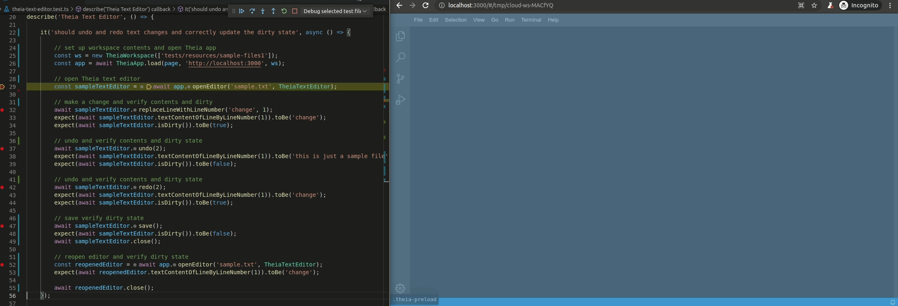

# Getting Started

The fastest way to getting started is to clone the [theia-playwright-template](https://github.com/eclipse-theia/theia-playwright-template) and build the theia-playwright-template.

```bash
git clone git@github.com:eclipse-theia/theia-playwright-template.git
cd theia-playwright-template
yarn
```

The most important files in the theia-playwright-template are:

* Example test in `tests/theia-app.test.ts`
* Example page object in `test/page-objects/theia-app.ts`
* The base Playwright configuration file at `playwright.config.ts`
* `package.json` with all required dependencies and scripts for running and debugging the tests

Now, let's run the tests:

1. Run your Theia application under test (not part of the theia-playwright-template)
2. Run `yarn ui-tests` in the theia-playwright-template to run its tests in headless mode

Please note that Theia 🎭 Playwright is built to be extended with custom page objects, such as the one in `test/page-objects/theia-app.ts` in the theia-playwright-template.
We recommend adding further page objects for all custom views, editors, widgets, etc.
Please refer to the [extension guide](EXTENSIBILITY.md) for more information.

Moreover, this repository contains several tests based on Theia 🎭 Playwright in `examples/playwright/src/tests` that may serve as additional examples for writing tests.

## Adding further tests

Let's write another system test for the Theia text editor as an example:

1. Initialize a prepared workspace containing a file `sampleFolder/sample.txt` and open the workspace with the Theia application under test
2. Open the Theia text editor
3. Replace the contents of line 1 with `change` and check the line contents and the dirty state, which now should indicate that the editor is dirty.
4. Perform an undo twice and verify that the line contents should be what it was before the change. The dirty state should be clean again.
5. Run redo twice and check that line 1 shows the text `change` again. Also, the dirty state should be changed again.
6. Save the editor with the saved contents and check whether the editor state is clean after save. Close the editor.
7. Reopen the same file and check whether the contents of line 1 shows still the changed contents.

The test code could look as follows. We use the page objects `TheiaWorkspace` and `TheiaApp` to initialize the application with a prepared workspace.
Using the `TheiaApp` instance, we open an editor of type `TheiaTextEditor`, which allows us to exercise actions, such as replacing line contents, undo, redo, etc.
At any time, we can also get information from the text editor, such as obtaining dirty state and verify whether this information is what we expect.

```typescript
test('should undo and redo text changes and correctly update the dirty state', async ({ playwright, browser }) => {
    // 1. set up workspace contents and open Theia app
    const ws = new TheiaWorkspace([path.resolve(__dirname, 'resources/sample-files1']);
    app = await TheiaAppLoader.load( { playwright, browser }, ws);

    // 2. open Theia text editor
    const sampleTextEditor = await app.openEditor(
        'sample.txt',
        TheiaTextEditor
    );

    // 3. make a change and verify contents and dirty
    await sampleTextEditor.replaceLineWithLineNumber('change', 1);
    expect(await sampleTextEditor.textContentOfLineByLineNumber(1)).toBe(
        'change'
    );
    expect(await sampleTextEditor.isDirty()).toBe(true);

    // 4. undo and verify contents and dirty state
    await sampleTextEditor.undo(2);
    expect(await sampleTextEditor.textContentOfLineByLineNumber(1)).toBe(
        'this is just a sample file'
    );
    expect(await sampleTextEditor.isDirty()).toBe(false);

    // 5. undo and verify contents and dirty state
    await sampleTextEditor.redo(2);
    expect(await sampleTextEditor.textContentOfLineByLineNumber(1)).toBe(
        'change'
    );
    expect(await sampleTextEditor.isDirty()).toBe(true);

    // 6. save verify dirty state
    await sampleTextEditor.save();
    expect(await sampleTextEditor.isDirty()).toBe(false);
    await sampleTextEditor.close();

    // 7. reopen editor and verify dirty state
    const reopenedEditor = await app.openEditor('sample.txt', TheiaTextEditor);
    expect(await reopenedEditor.textContentOfLineByLineNumber(1)).toBe(
        'change'
    );

    await reopenedEditor.close();
});
```

Below you can see this example test in action by stepping through the code with the VS Code debug tools.

<div style='margin:0 auto;width:100%;'>



</div>

## Best practices

The playwright tests/functions are all asynchronous so the `await` keyword should be used to wait for the result of a given function.
This way there is no need to use timeouts or other functions to wait for a specific result.
As long as await is used on any call, the tests should be in the intended state.

There are two ways to query the page for elements using a selector.

1. One is the `page.$(selector)` method, which returns null or the element, if it is available.
2. The other method `page.waitForSelector(selector)`, like indicated by the name, waits until the selector becomes available. This ensures that the element could be loaded and therefore negates the
   need for null checks afterwards.

Avoid directly interacting with the document object model, such as HTML elements, or the Playwright `page` from tests directly.
The interaction with the application should be encapsulated in the page objects.
Otherwise, your tests will get bloated and more fragile to changes of the application.
For more information, refer to the [page object pattern](https://martinfowler.com/bliki/PageObject.html).

Avoid returning or exposing Playwright types from page objects.
This keeps your tests independent of the underlying browser automation framework.

## Executing tests

## Building

Run `yarn` in the root directory of the repository to build the Theia application.

In order to build Playwright library, the tests and install all dependencies (ex: chromium) run the build script:

```bash
cd examples/playwright
yarn build
```

### Starting the Theia Application under test

Before running your tests, the Theia application under test needs to be running.
This repository already provides an example Theia application, however, you might want to test your custom Theia-based application instead.

The Playwright configuration however is aware of that and starts the backend (`yarn theia:start`) on port 3000 if not already running.
This is valid for executing tests with the VS Code Playwright extension or from your command line.

### Running the tests in VS Code via the Playwright extension

For quick and easy execution of tests in VS Code, we recommend using the [VS Code Playwright extension (`ms-playwright.playwright`)](https://marketplace.visualstudio.com/items?itemName=ms-playwright.playwright).

Once you have installed the VS Code Playwright test extension, open the *Test* view and click the `Run Tests` button on the top toolbar or the `Run Test` button for a particular test.
It uses the default configuration with chromium as test profile by default.

To run the tests headful, simply enable the checkbox `Show browser` in the Playwright section of the *Test* view.

### Running the tests headless via CLI

To start the tests run `yarn ui-tests` in the folder `playwright`.
This will start the tests in a headless state.

To only run a single test file, the path of a test file can be set with `yarn ui-tests <path-to-file>` or `yarn ui-tests -g "<partial test file name>"`.
See the [Playwright Test command line documentation](https://playwright.dev/docs/intro#command-line).

### Running the tests headful via CLI

If you want to observe the execution of the tests in a browser, use `yarn ui-tests-headful` for all tests or `yarn ui-tests-headful <path-to-file>` to only run a specific test.

### Debugging the tests via the VS Code Playwright extension

To debug Playwright tests, open the *Test* view in VS Code and click the `Debug Tests` button on the top toolbar or the `Debug Test` for a particular test.
It uses the default configuration with chromium as test profile by default.

For more information on debugging, please refer to the [Playwright documentation](https://playwright.dev/docs/debug).

### UI Mode - Watch and Trace Mode

For an advanced test development experience, Playwright provides the so-called *UI Mode*. To enable this, simply add the flag `--ui` to the CLI command.

```bash
yarn ui-tests --ui
```

For more information on the UI mode, please refer to the [Playwright announcement of the UI mode](https://playwright.dev/docs/release-notes#introducing-ui-mode-preview).

## Advanced Topics

There are many more features, configuration and command line options from Playwright that can be used.
These range from grouping and annotating tests, further reporters, to visual comparisons, etc.
For more information refer to the [Playwright documentation](https://playwright.dev/docs/intro).
